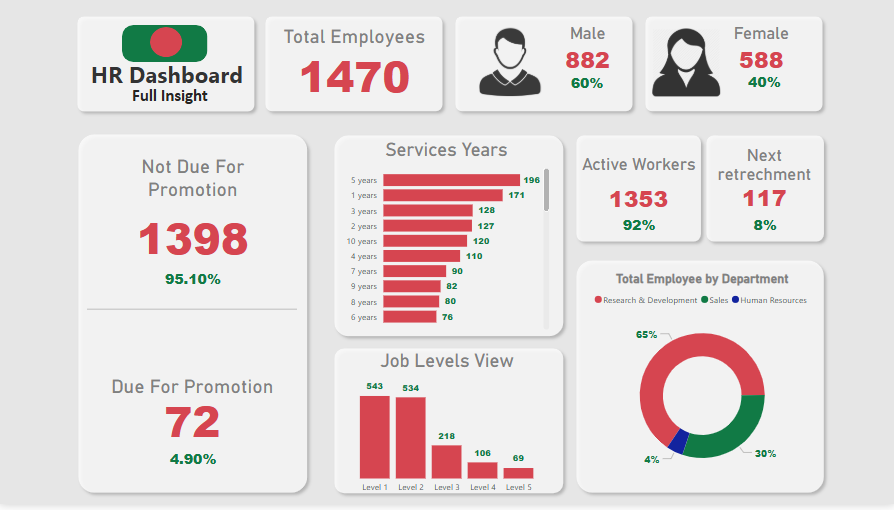

# HR Analytics Dashboard - Power BI

A comprehensive Power BI dashboard for Human Resources analytics, providing insights into workforce metrics, diversity statistics, and talent management indicators.

## 📊 Dashboard Overview

This interactive dashboard enables HR professionals to:
- Track workforce composition and demographics
- Analyze gender distribution across departments
- Evaluate promotion eligibility and readiness
- Monitor key HR metrics at a glance

## 🛠️ Features

- **Employee Demographics**: Breakdown by gender, age, and department
- **Promotion Analysis**: Eligibility and readiness metrics
- **Interactive Filters**: Drill-down capabilities for deeper analysis
- **Responsive Design**: Adapts to different screen sizes

## 🚀 Getting Started

### Prerequisites
- [Power BI Desktop](https://powerbi.microsoft.com/en-us/desktop/) (free download)

### Installation
1. Clone this repository or download the `.pbix` file directly
2. Open `-HR---Dashboard-` in Power BI Desktop
3. Explore the dashboard and interact with the visualizations

## 🌟 Contact  

<table align="center">
  <tr>
    <td align="center" width="96">
      
       <b>Email</b>
    </td>
    <td align="center" width="96">
      
       <b>LinkedIn</b>
    </td>
    <td align="center" width="96">
      
       <b>GitHub</b>
    </td>
    <td align="center" width="96">
      
       <b>Project</b>
    </td>
  </tr>
</table>

  
  
  

  <i>Open to collaborations and data analytics opportunities!</i> ✨

